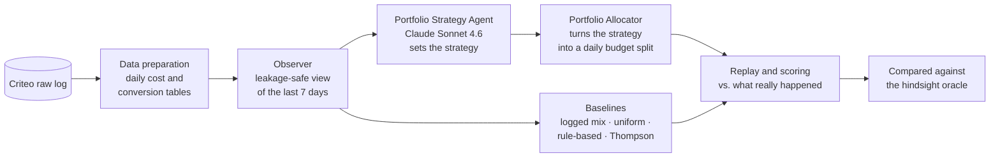

<div align="center">

# Agentic AI for Autonomous Digital Marketing Campaign Management

**Can a team of LLM agents run a paid-media budget on its own, and how close does it get to perfect hindsight?**

MSc Data Science thesis · upGrad × Liverpool John Moores University · 2026


</div>

---

## Contents

1. [The project in 60 seconds](#1-the-project-in-60-seconds)
2. [How the system works](#2-how-the-system-works)
3. [How it is evaluated](#3-how-it-is-evaluated)
4. [Repository map](#4-repository-map)
5. [Quick start](#5-quick-start)
6. [Reproducing the thesis experiments](#6-reproducing-the-thesis-experiments)
7. [Outputs](#7-outputs)
8. [Design decisions](#8-design-decisions)
9. [Limitations and future work](#9-limitations-and-future-work)
10. [Citation and author](#10-citation-and-author)

---

## 1. The project in 60 seconds

**The problem.** Paid-media teams spend much of their week on the same loop: pull the numbers, spot what changed, decide where the money should go, adjust budgets, and repeat the next day.

**The question.** Can LLM agents run that loop on their own? And are their decisions better than simple rules, a standard statistical method (Thompson sampling), and how close do they get to an oracle that knows the future?

**The approach.** The system replays a **30-day log of real advertising data** (Criteo, public dataset) one day at a time. Each morning the agents see only what a real marketer would have known that morning. They choose where to spend a fixed budget, and the decisions are then scored against what actually happened.

**What makes the comparison fair:**

| Safeguard | What it means |
|---|---|
| **No look-ahead** | Agents only see conversions that had already been reported before the decision day. This is checked by automated tests (`tests/test_leakage.py`). |
| **Same budget, same data** | Every strategy gets the same daily budget and the same campaigns. |
| **Hindsight oracle** | An upper bound that allocates with perfect knowledge of the day's results. Every score is reported as **% of oracle conversions**. |
| **Deterministic LLM** | `temperature = 0` for every LLM call, and LLM decisions are cached and logged, so runs can be replayed exactly. |
| **Repeated runs** | 3 random seeds × 3 budget levels × every decision day, with bootstrap confidence intervals and Holm correction. |

The project uses **public data only**. No client or company data is involved.

---

## 2. How the system works

The project was built in two stages. **Stage 1** is a full multi-agent prototype. **Stage 2** is the refined portfolio-level system used for the final thesis results.

### Stage 2: final evaluated system



What happens on each simulated day:

1. **Observer** (`src/agents/observer_v2.py`, `src/data/criteo_prep.py`) builds a 7-day summary per campaign: spend, clicks, CTR, known conversions and CPA. Conversions that had not been reported yet are hidden.
2. **Portfolio Strategy Agent** (`src/agents/portfolio_strategy.py`) gives Claude the top 25 campaigns, each with a 90% credible interval for its CPA, plus a warning about conversion lag. Claude replies in structured JSON:
   - overall stance: `aggressive`, `balanced` or `conservative`
   - campaigns to **protect** and campaigns to **exclude**
   - whether to **escalate to a human**, with a confidence level and a one-line reason

   If the reply cannot be used, the agent falls back to a safe `balanced` strategy, and this is logged.
3. **Portfolio Allocator** turns that strategy into money. It scores campaigns statistically (Gamma–Poisson sampling), applies the protect, exclude and stance rules, and fills the budget greedily, never spending more than a campaign could absorb.
4. **Replay and scoring** compares each allocation with the real outcome for that day. Conversions scale with spend, capped at what the campaign actually spent.

### Stage 1: multi-agent prototype

The first version (`src/simulation_loop_llm.py`) chains specialised agents with a shared memory:

| Agent | File | Role |
|---|---|---|
| Observer | `src/agents/observer.py` | Loads and validates the raw data and flags anomalies |
| Analyst | `src/agents/analyst.py` | Claude interprets performance using chain-of-thought reasoning |
| Strategy | `src/agents/strategy.py` | Claude proposes campaign actions using a ReAct-style prompt |
| Execution | `src/agents/execution.py` | Logs each AI decision next to the human decision in the data and flags disagreements |
| Memory | `src/agents/memory.py` | ChromaDB vector store, so agents can recall earlier days' decisions |

This prototype showed that the agent loop worked end to end. It also revealed issues (calendar-day handling, conversion counting, data leakage risk) that Stage 2 was built to fix. The commit history records each round of fixes.

---

## 3. How it is evaluated

### Strategies compared (6 policies)

| Policy | Description |
|---|---|
| `llm_portfolio` | **The agentic system:** Claude sets the strategy and the allocator executes it |
| `thompson_sampling` | Standard Bayesian bandit baseline, with no LLM |
| `rule_based` | A typical marketer's rule: rank by CPA and cut campaigns that spend with no conversions |
| `logged_mix` | Keep yesterday's spend proportions (status quo) |
| `uniform` | Random order, as a sanity floor |
| `hindsight_oracle` | Perfect knowledge of the day's results, used as the upper bound |

### Experimental grid

- **Decision days:** every day from day 7 onward, except the last few days of the log. The first 7 days are a warm-up window, and the final days are held back so that conversions have time to be reported.
- **Budget levels:** ½, ¼ and ⅛ of the actual daily spend. Tighter budgets make the choices harder.
- **Seeds:** 3 per day and budget level.
- **Main metric:** % of hindsight-oracle conversions (higher is better).

### Additional analyses

| Analysis | Script | Question it answers |
|---|---|---|
| Paired bootstrap + Holm correction | `src/evaluation/analyse_v2.py` | Is the LLM really better or worse than each baseline? |
| Calibration | `analyse_v2.py` | When Claude says "high confidence", is it actually right more often? |
| Escalation audit | `analyse_v2.py` | Does it ask for a human on the hard days? |
| Protection audit | `analyse_v2.py` | Were the campaigns it protected actually good ones? |
| Lag ablation | `analyse_v2.py --ablation` | Does warning the LLM about conversion lag change its decisions? |
| Protect-off replay | `src/evaluation/protect_off_replay.py` | What happens to the same decisions if protection is switched off? |
| 7-model comparison | `src/model_comparison.py` | How do Claude and 6 local open models handle the same 5 marketing scenarios? |

Models compared: Claude Sonnet 4.6 (API), and Qwen3 8B, Gemma3 4B, Llama 3.2 3B, Mistral 7B, DeepSeek-R1 8B and Phi-4 14B running locally via Ollama.

---

## 4. Repository map

```
agentic-marketing-ai/
├── main.py                        ← start here: one command for every step
├── requirements.txt
├── .env.example                   ← copy to .env and add your API key
│
├── src/
│   ├── data/
│   │   └── criteo_prep.py         Stage 2 · raw log → daily tables + leakage-safe view
│   ├── agents/
│   │   ├── observer_v2.py         Stage 2 · Observer
│   │   ├── portfolio_strategy.py  Stage 2 · Portfolio Strategy Agent + Allocator + baselines
│   │   ├── observer.py            Stage 1 · Observer
│   │   ├── analyst.py             Stage 1 · Analyst Agent
│   │   ├── strategy.py            Stage 1 · Strategy Agent
│   │   ├── execution.py           Stage 1 · Execution Agent / decision logger
│   │   └── memory.py              Stage 1 · ChromaDB memory layer
│   ├── evaluation/
│   │   ├── analyse_v2.py          Stage 2 · statistics, calibration, audits, ablation
│   │   ├── protect_off_replay.py  Stage 2 · reproducibility / protect-off replay
│   │   ├── response_curves.py     Stage 1 · spend → conversion response curves
│   │   └── statistical_analysis.py Stage 1 · paired t-tests, Cohen's d
│   ├── simulation_loop_v2.py      Stage 2 · replay simulation (final results)
│   ├── simulation_loop_llm.py     Stage 1 · full LLM agent loop
│   ├── simulation_loop.py         Stage 1 · rule-only loop
│   └── model_comparison.py        7-model comparison
│
└── tests/
    └── test_leakage.py            proves the agents cannot see future data
```

Generated folders (`data/`, `results/`, `logs/`) are git-ignored.

---

## 5. Quick start

**Requirements:** Python 3.11 or newer, an [Anthropic API key](https://console.anthropic.com/) for the Claude agents, and (optionally) [Ollama](https://ollama.com) for the local-model comparison.

```bash
# 1. Get the code
git clone https://github.com/saikumarljmu-maker/agentic-marketing-ai.git
cd agentic-marketing-ai

# 2. Create an environment and install dependencies
python -m venv .venv
source .venv/bin/activate          # Windows: .venv\Scripts\activate
pip install -r requirements.txt

# 3. Add your API key
cp .env.example .env               # then edit .env

# 4. Check everything works (no data or API key needed)
python main.py test
```

### Get the data

Download the **Criteo Attribution Modeling for Bidding** dataset from the [Criteo AI Lab](https://ailab.criteo.com/criteo-attribution-modeling-bidding-dataset/) and place it here:

```
data/raw/criteo_attribution_dataset/criteo_attribution_dataset.tsv
```

The dataset is not included in this repository because of its size and licence.

---

## 6. Reproducing the thesis experiments

Run every command from the repository root. `python main.py <command> --help` lists all options.

| Step | Command | What it does | Needs API key |
|---|---|---|---|
| 1 | `python main.py prepare` | Builds `data/processed/daily_cost.parquet` and `conversions.parquet` | No |
| 2 | `python main.py simulate` | Runs the 6-policy replay (all decision days × 3 budgets × 3 seeds) | Yes |
| 3 | `python main.py analyse` | Bootstrap CIs, calibration, escalation and protection audits | No |
| 4 | `python main.py protect-off` | Replays the saved LLM decisions with protection on and off | No |
| 5 | `python main.py compare-models` | 7-model comparison (needs Ollama for local models) | Yes |

**Lag ablation** (optional):

```bash
python main.py simulate --no-lag-note --run-name v2_nolag
python main.py analyse --run v2 --ablation v2_nolag
```

**Dry run without the LLM:** `python main.py simulate --no-llm` runs the full pipeline at no API cost. The LLM policy then falls back to Thompson sampling.

---

## 7. Outputs

| File | Contents |
|---|---|
| `results/replay_results_v2.parquet` | Conversions, spend, CPA and % of oracle for every policy, day, budget and seed |
| `results/run_meta_v2.json` | Per-day metadata: strategy, confidence, escalation, fallbacks |
| `logs/llm_portfolio_decisions_v2.jsonl` | Every Claude decision with its reasoning, tokens and cost in USD |
| `results/analysis_v2/bootstrap.csv` | Pairwise comparisons with 95% CIs and Holm-adjusted p-values |
| `results/analysis_v2/calibration.csv` | Confidence level vs. actual performance |
| `results/analysis_v2/escalation.json` · `protection_audit.json` | Escalation and protection audits |
| `results/protect_off_v2.csv` | Protect-on vs. protect-off comparison |

The full results tables and their discussion are in **Chapter 4 (Results)** of the thesis.

---

## 8. Design decisions

- **The LLM sets the strategy, and a statistical allocator handles the money.** Claude chooses the stance, which campaigns to protect or exclude, and when to escalate. The exact amounts are computed by a transparent statistical allocator. This keeps every decision explainable and auditable.
- **Sequential orchestration instead of LangGraph.** LangGraph was evaluated. Plain Python calls kept the control flow transparent and easier to test and reproduce.
- **Uncertainty is shown to the LLM.** Each campaign's CPA is given with a 90% credible interval, so the model can tell a real signal from noise.
- **Built-in human escalation.** The agent can flag a day for human review, and the escalation audit checks whether it did so on the right days.
- **Fails safe.** If the API fails or Claude returns unusable output, the system uses a neutral strategy and records the fallback.

---

## 9. Limitations and future work

- **Retrospective replay.** The simulation cannot capture live auction dynamics or competitor reactions. Spend is assumed to scale conversions linearly up to the campaign's actual spend.
- **Single primary dataset.** Benchmarking on iPinYou RTB against RTBAgent is planned as future work.
- **Next steps:** a live A/B test in a sandbox ad account, and a human-in-the-loop approval mode.

---

## 10. Citation and author

```
Sai Kumar Matta (2026). Agentic AI for Autonomous Digital Marketing Campaign Management:
A Retrospective Simulation Study Using Public Benchmark Datasets.
MSc Data Science thesis, Liverpool John Moores University.
```

**Supervisor:** Dr Anukriti Bansal

**Author:** Sai Kumar Matta, a digital marketer with 8+ years of hands-on paid-campaign experience, now working on applied AI for marketing.
[LinkedIn](https://linkedin.com/in/sai-kumar-m) · saikumar.matta@gmail.com
